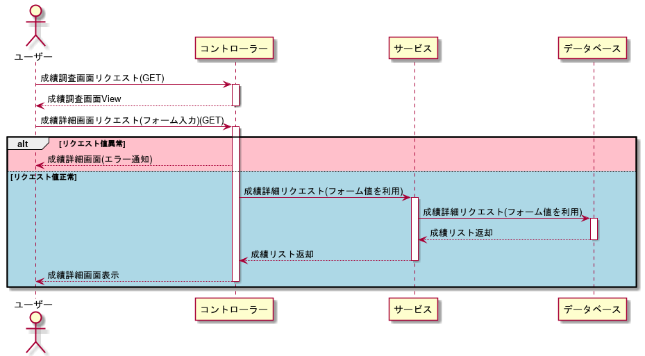

# my-school-managementアプリケーションとは？
学校などの生徒のテスト結果などを管理するアプリケーション

# アプリケーションURL
未実装

## 使用技術
### フレームワーク・言語
* Spring Boot
    * JPA ・Thymeleaf ・AOP ・ SpringSecurity
* Java
* HTML5
* CSS(Sass)
* JavaScript
  * chart.js

### データベース
* mySQL

### インフラ
* 実装予定なし

## 利用方法
※ 未実装

## 作成した理由・背景
主に勉強の過程として
  
springのjpa・securityやjavaでのexcel操作のライブラリ(poi)等をある程度を学び、またjsのchart.js等を学習し、
これらの技術を組み合わせて何か作れないかと考え、上記の様なアプリケーションが思い浮かび作成してみました。

## アプリケーション機能

## フロント

<table>
  <tr>
    <th>機能</th>
    <th>目的</th>
    <th>実装方法</th>
  </tr>
  <tr>
    <td>ログイン機能</td>
    <td>登録しているユーザーのみ利用可能とするため</td>
    <td>ログインページにIDとパスワードの入力欄とログインボタンのフォームを配置</td>
  </tr>
  <tr>
    <td>メニュー表示</td>
    <td>ユーザーが利用したい機能を表示させる</td>
    <td>ログイン画面以外にヘッダーを配置し、機能ごとの遷移リンクを配置。メインメニューには一覧を表示しリンクを配置</td>
  </tr>
  <tr>
    <td>生徒とテスト結果の登録・更新画面</td>
    <td>ユーザーの情報とテスト結果を登録・更新したい</td>
    <td>ユーザー情報・テスト情報を選択するラジオボタン、新規登録・更新を選択するラジオボタン、ファイル添付を持つフォームを設置した画面を作成</td>
  </tr>
  <tr>
    <td>学年・クラス情報の作成</td>
    <td>新たな年の学年クラス情報登録</td>
    <td>年度・学年をラジオボタンで選択し、クラスをチェックボタンで選択する、以上の情報を持つフォームを設置
    した画面を作成</td>
  </tr>
  <tr>
    <td>データ挿入用のExcelテンプレートダウンロード(試験用)</td>
    <td>新規挿入用のテンプレートをダウンロードする</td>
    <td>学年・クラス・教科・時期・年度情報を選択するフォーム画面を設置した画面を作成する</td>
  </tr>
  <tr>
    <td>データ挿入用のExcelテンプレートダウンロード(学生情報用)</td>
    <td>新規挿入用のテンプレートをダウンロードする</td>
    <td>学年・年度情報を選択するフォーム画面を設置した画面を作成する</td>
  </tr>
  <tr>
    <td>成績調査(全体)</td>
    <td>クラス・学年・時期・教科ごと等の成績の調査を行いたい</td>
    <td>年度・学年・クラス・時期・教科ごと点数ごとのソートオプションを含んだフォームを持つ画面を作成する。
また検索結果に応じたグラフ・表なども設置する</td>
  </tr>
  <tr>
    <td>成績調査(個人)</td>
    <td>クラス・学年・時期・教科ごと等の成績の調査を行いたい</td>
    <td>年度・学年・クラス・時期・教科ごと点数ごとのソートオプションを含んだフォームを持つ画面を作成する。
また検索結果に応じたグラフ・表なども設置する</td>
  </tr>
  <tr>
    <td>合計点調査(全体)</td>
    <td>クラス・学年・時期ごと等の個人の合計点の成績の調査を行いたい</td>
    <td>年度・学年・クラス・時期ごと点数ごとのソートオプション・表示数を含んだフォームを持つ画面を作成する。
また検索結果に応じたグラフ・表なども設置する。結果をExcelで出力するボタンも配置する</td>
  </tr>
  <tr>
    <td>生徒検索</td>
    <td>特定の生徒を検索したい</td>
    <td>年度・学年・クラス・氏名情報入力欄を含んだフォームを持つ画面を作成する。また検索結果に応じた表も設置する。</td>
  </tr>
  <tr>
    <td>パスワード・ユーザーID更新</td>
    <td>パスワード・ユーザーIDを更新したい</td>
    <td>新たなパスワード・ユーザーIDを入力するフォームを設置した画面を作成する</td>
  </tr>
  
</table>

## バックエンド

<table>
  <tr>
    <th>機能</th>
    <th>目的</th>
    <th>実装方法</th>
  </tr>
  <tr>
    <td>ログイン機能</td>
    <td>登録しているユーザーのみ利用可能とするため</td>
    <td>SpringSecurityを使用しIDとパスワードをデータベースに登録されているユーザーと一致するか確認し、一致した場合のみログインさせる</td>
  </tr>
  <tr>
    <td>生徒の登録・更新(一括処理)</td>
    <td>生徒情報を登録・更新したい</td>
    <td>Excelファイルを読み込み、リスト化した上でDBに登録する</td>
  </tr>
  <tr>
    <td>テスト情報の登録・更新(一括処理)</td>
    <td>試験情報を登録・更新したい</td>
    <td>Excelファイルを読み込み、リスト化した上でDBに登録する</td>
  </tr>
  <tr>
    <td>学年・クラス情報の作成</td>
    <td>新たな年の学年クラス情報登録</td>
    <td>登録したい年度・学年・クラス情報(リスト)を受け取り、DBに登録する</td>
  </tr>
  <tr>
    <td>データ挿入用のExcelテンプレートダウンロード(試験用)</td>
    <td>新規挿入用のテンプレートをダウンロードする</td>
    <td>学年・クラス・教科・時期・年度情報を元にデータベースから生徒の情報を取得し、入力情報及びDBから取得した情報を
元にExcel形式で出力・ダウンロードさせる</td>
  </tr>
  <tr>
    <td>データ挿入用のExcelテンプレートダウンロード(学生情報用)</td>
    <td>新規挿入用のテンプレートをダウンロードする</td>
    <td>学年・年度情報を元に場合によってDBから情報を取得し、その情報を元にExcel情報出力・ダウンロードさせる</td>
  </tr>
  <tr>
    <td>成績調査(全体)</td>
    <td>クラス・学年・時期・教科ごと等の成績の調査を行いたい</td>
    <td>年度・学年・クラス・時期・教科情報、教科・点数のソートオプションを元にDBから情報を取得する。</td>
  </tr>
  <tr>
    <td>成績調査(個人)</td>
    <td>クラス・学年・時期・教科ごと等の成績の調査を行いたい</td>
    <td>年度・学年・クラス・時期・教科・ユーザーID・ソートオプションの情報を元にDBから情報を取得する</td>
  </tr>
  <tr>
    <td>合計点調査(全体)</td>
    <td>クラス・学年・時期ごと等の個人の合計点の成績の調査を行いたい</td>
    <td>年度・学年・クラス・時期、点数のソートオプション・表示数情報を元にDBから情報を取得する。</td>
  </tr>
  <tr>
    <td>生徒検索</td>
    <td>特定の生徒を検索したい</td>
    <td>年度・学年・クラス・氏名情報を元にDBから情報を取得する</td>
  </tr>
  <tr>
    <td>パスワード・ユーザーID更新</td>
    <td>パスワード・ユーザーIDを更新したい</td>
    <td>DBからユーザーの情報を取得、入力されたパスワード・ユーザーIDを取得したユーザー情報にセットし、DBのユーザー情報を更新する</td>
  </tr>

  <tr>
    <td>ログ出力機能</td>
    <td>誰が・いつ・何の機能を利用したか出力したい</td>
    <td>AOPの実装をし、利用した機能ごとにログ出力するようにする</td>
  </tr>
  <tr>
    <td>アクセス機能(セキュリティ・認可)</td>
    <td>ユーザーの生徒・教師ごとに使える機能を分けたい</td>
    <td>SpringSecurityで認可処理を実装する、またDBにはユーザーごとにロール情報を持たせる、持っているロールごとに使える機能を制限する</td>
  </tr>
  
</table>

### 各種画面

<table>

  <tr>
    <th>画面名</th>
    <th>詳細</th>
    <th>ファイル名</th>
  </tr>
  <tr>
    <td>ログイン画面</td>
    <td>ログインの画面</td>
    <td>login.html</td>
  </tr>
  <tr>
    <td>メニュー画面</td>
    <td>各種の機能選択画面</td>
    <td>main.html</td>
  </tr>
  <tr>
    <td>ユーザー・テスト情報登録・更新画面</td>
    <td>ユーザー・テスト情報の登録・更新画面</td>
    <td>data-registration.html</td>
  </tr>
  <tr>
    <td>学年・クラス登録画面</td>
    <td>学年・クラス情報を登録する画面</td>
    <td>grade-class-registration.html</td>
  </tr>
  <tr>
    <td>成績調査画面(全体)</td>
    <td>年度・学年・クラス・教科・時期ごとの情報から全体的にな成績情報を出力する画面</td>
    <td>survey-form.html</td>
  </tr>
  <tr>
    <td>成績調査画面(個人)</td>
    <td>年度・学年・教科・時期ごとの情報から個人の成績情報を出力する画面</td>
    <td>student-survey-form.html</td>
  </tr>
  <tr>
    <td>成績合計点調査画面</td>
    <td>年度・学年・教科・時期ごとの情報から個人別の合計点の成績情報を出力する画面</td>
    <td>sum-survey-form.html</td>
  </tr>
  <tr>
    <td>生徒情報検索画面</td>
    <td>生徒の情報を検索する画面</td>
    <td>student-search-form.html</td>
  </tr>
  <tr>
    <td>ユーザー情報更新画面</td>
    <td>ユーザー情報を更新する画面</td>
    <td>password-change.html</td>
  </tr>
  <tr>
    <td>エラー画面</td>
    <td>400系のエラー等を表示する画面</td>
    <td>400.html・403.html・404.html・error.html・excel-error.html</td>
  </tr>
  <tr>
    <td>その他</td>
    <td>ヘッダー・フッター等の共通部分のモジュール</td>
    <td>header.html footer.html</td>
  </tr>
</table>

### データベースのテーブル一覧

<table>
  <tr>
    <th>テーブル名</th>
    <th>概要</th>
    <th>関連</th>
  </tr>
  <tr>
    <td>app_user</td>
    <td>ユーザー情報</td>
    <td>role</td>
  </tr>
  <tr>
    <td>role</td>
    <td>ユーザーのロール情報</td>
    <td>app_user</td>
  </tr>
  <tr>
    <td>user_grade_class</td>
    <td>学年情報・ユーザーの中間テーブル</td>
    <td>app_user, grade_class</td>
  </tr>
  <tr>
    <td>grade_class</td>
    <td>学年情報テーブル</td>
    <td>grade_class</td>
  </tr>
  <tr>
    <td>user_test</td>
    <td>ユーザー・テストの中間テーブル</td>
    <td>app_user, test</td>
  </tr>
  <tr>
    <td>test</td>
    <td>テスト情報テーブル</td>
    <td>user_test</td>
  </tr>
</table>

## UML・ER

### ER図

### ユースケース図

### シーケンス図

[//]: # ()
[//]: # (#### ユーザー登録の流れ)

[//]: # (![ユーザー登録シーケンス図]&#40;plantuml/signup_se.png&#41;)

### ログイン処理の流れ

### ユーザー・テスト情報登録更新処理の流れ

### 成績調査処理の流れ

[//]: # ()
[//]: # (### タスク削除処理の流れ)

[//]: # (![タスク削除シーケンス図]&#40;plantuml/task_delete_se.png&#41;)

[//]: # ()
[//]: # (### タスク参照処理の流れ)

[//]: # (![タスク参照シーケンス図]&#40;plantuml/task_select_se.png&#41;)

[//]: # ()
[//]: # (## クラス図)

[//]: # ()
[//]: # (### ログイン・ユーザー登録関連のクラス図)

[//]: # (![ログイン・ユーザー登録関連のクラス図]&#40;plantuml/login_user_register_class.png&#41;)

[//]: # ()
[//]: # (### タスク管理系のクラス図)

[//]: # (![タスク処理関連のクラス図]&#40;plantuml/task_relation_class.png&#41;)

[//]: # ()
[//]: # (## 画面遷移)

[//]: # (![Webの画面遷移図]&#40;plantuml/web_state.png&#41;)

[//]: # ()
[//]: # (## その他)